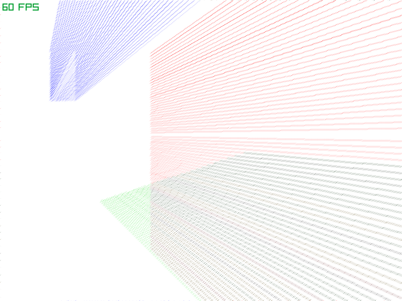

# GlassCast

GlassCast is a raytracing (more like raycasting) experiment revolving around glass material with subtractive coloring.

This project was built on a bunch of handy libraries, notably:

 - [Serde](https://serde.rs/)
 - [raylib](https://www.raylib.com) (via the [`raylib-rs`](https://github.com/deltaphc/raylib-rs) bindings)
 - [`geo`](https://github.com/georust/geo)
